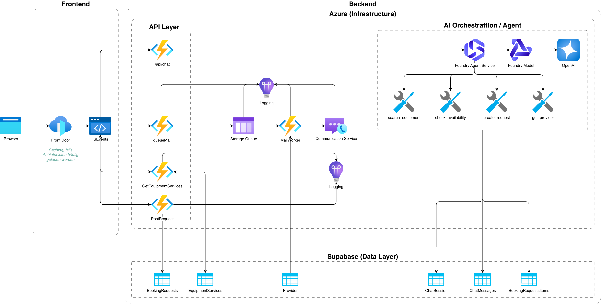

# ISEvents
ISEvents ist ein Marketplace für Event Equipment und Dienstleistung aus der Region Samtgemeinde Isenbüttel und Gifhorn. Über diese Plattform können Firmen sowie Private Kunden über ein zentrales System Equipment und Dienstleistung von mehreren Anbietern gleichzeitig anfragen.

## Aktueller Tech-Stack
Frontend
- TypeScript
- React
- Vite
- Hosting über Azure Static Web Apps
- Deployment über GitHub CI/CD
Backend / API
- Azure Functions mit TypeScript
- Azure Functions sollen die zentrale API- und Business-Logic-Schicht bleiben.
Datenbank
- Supabase Cloud
- PostgreSQL
- Supabase Auth
E-Mail
- Azure Communication Services
- Azure Communication Services Email
- Versand erfolgt serverseitig über Azure Functions.

## Architekturentscheidung
Die Business-Logik soll hauptsächlich auf Azure liegen.